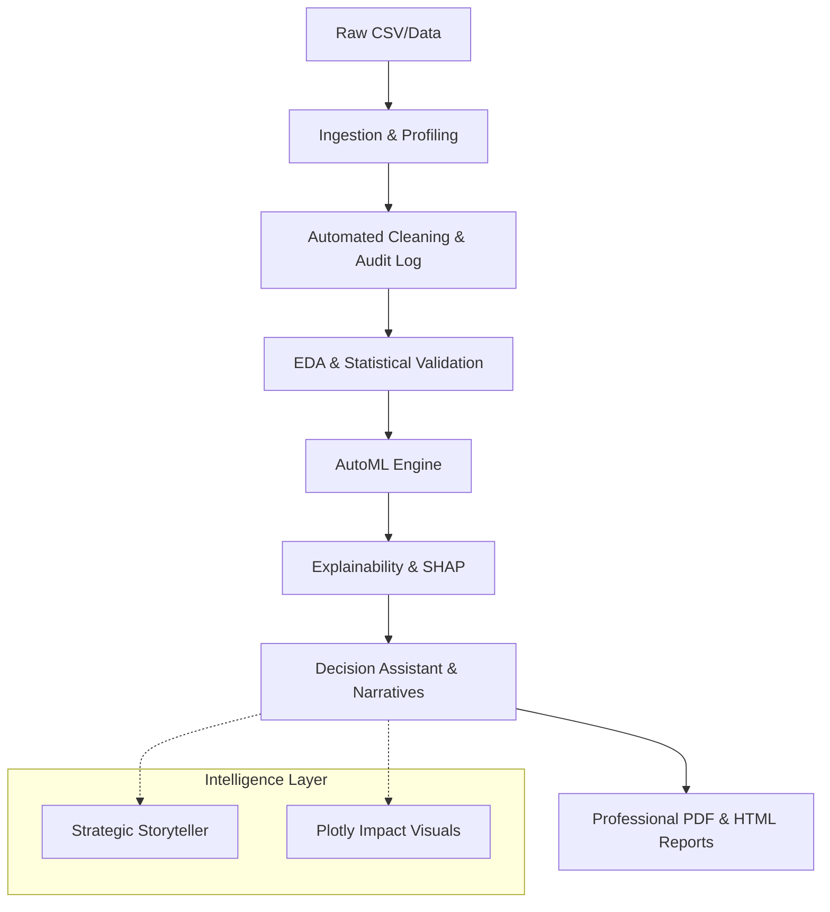

# AnalytixAI 🚀

> **Empowering Business Intelligence through Automated Data Science.**

AnalytixAI is a state-of-the-art, production-ready Automated Machine Learning (AutoML) platform. It transforms raw, messy datasets into boardroom-ready intelligence reports through a sophisticated 11-step automated pipeline, now featuring **Premium Glassmorphic Design** and **Strategic Narrative Intelligence**.

---

## 🏛️ Domain-Specific Intelligence

Unlike generic AutoML tools, AnalytixAI understands the context of your data.
- **💼 Business & Operations**: Focuses on resource optimization and demand forecasting.
- **📈 Finance**: Specialized in risk assessment, fraud detection, and valuation.
- **🏠 Real Estate**: Advanced market segmentation and property valuation engines.
- **👥 Customer Analytics**: Churn prediction and behavioral segmentation.

---

## 🌟 Key Capabilities

### 1. High-Fidelity Data Guardianship
*   **Auto-Profiling**: 0-100 Quality Scoring with detailed metric extraction.
*   **Audit Trail**: Every cleaning action (imputation, outlier removal, encoding) is logged for full transparency.

### 2. Strategic Narrative Intelligence (NEW)
*   **Executive Storyteller**: Rule-based engine that translates technical scores (RMSE, R2, SHAP) into human-readable strategic outlooks.
*   **Simulation Insights**: Proactive guidance based on "What-If" scenario outcomes.

### 3. Advanced AI Engine
*   **Interactive Simulations**: Real-time Plotly-powered impact charts for scenario planning.
*   **Explainability (XAI)**: Integrated SHAP and Feature Importance to make model "Black Boxes" transparent.
*   **Multi-Task Support**: Integrated Forecasting, Clustering, and Anomaly Detection.

### 4. Professional Reporting 2.0
*   **Dual-Format Export**: One-click generation of professional PDF reports and Interactive HTML dashboards.
*   **Premium Aesthetics**: Modern "Glassmorphic" interface with micro-animations and vibrant themes.

---

## 📐 System Architecture



---

## 🛠️ Technology Stack

| Layer | Technology |
| :--- | :--- |
| **Backend** | Python, FastAPI, Uvicorn |
| **Frontend** | Streamlit (Custom Glassmorphic Design) |
| **Visuals** | Plotly, Matplotlib |
| **Intelligence** | Scikit-Learn, SHAP, Statsmodels, Pandas |
| **Reporting** | FPDF2, HTML5/CSS3 |

---

## 🚀 Getting Started

### Installation
```bash
# Clone and install dependencies
git clone https://github.com/your-repo/AnalytixAI.git
pip install -r requirements.txt
```

### Running the Platform
1.  **Start Backend**: `uvicorn app.main:app --port 8000`
2.  **Start Frontend**: `streamlit run streamlit_app/Home.py`

---

## 📚 Technical Reference
- [Architecture Deep Dive](file:///r:/2026/Project/AnalytixAI/ARCHITECTURE.md)
- [Feature Roadmap](file:///r:/2026/Project/AnalytixAI/FEATURES.md)

---
*Developed by Rajveer Singhal for the next generation of data-driven enterprises.*
