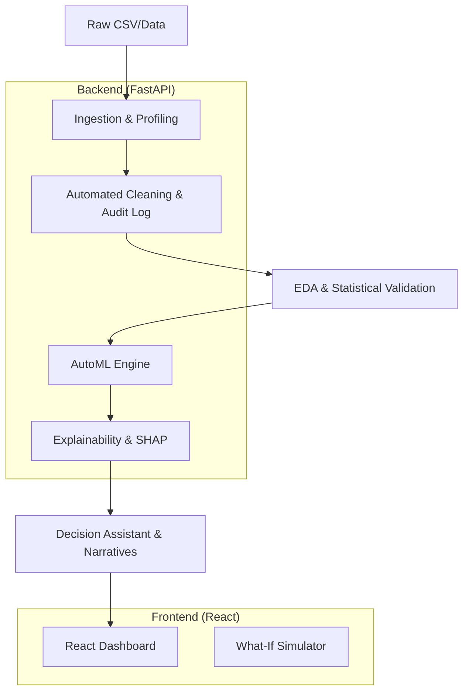

# AnalytixAI 🚀

> **Empowering Business Intelligence through Automated Data Science.**

AnalytixAI is a state-of-the-art, production-ready Automated Machine Learning (AutoML) platform. It transforms raw, messy datasets into boardroom-ready intelligence reports through a sophisticated 11-step automated pipeline, featuring **Premium Design** and **Strategic Narrative Intelligence**.

---

## 🏛️ Domain-Specific Intelligence

Unlike generic AutoML tools, AnalytixAI understands the context of your data:
- **💼 Business & Operations**: Focuses on resource optimization and demand forecasting.
- **📈 Finance**: Specialized in risk assessment, fraud detection, and valuation.
- **🏠 Real Estate**: Advanced market segmentation and property valuation engines.
- **👥 Customer Analytics**: Churn prediction and behavioral segmentation.

---

## 🌟 Key Capabilities

### 1. High-Fidelity Data Guardianship
*   **Auto-Profiling**: 0-100 Quality Scoring with detailed metric extraction.
*   **Audit Trail**: Every cleaning action (imputation, outlier removal, encoding) is logged for full transparency.

### 2. Strategic Narrative Intelligence
*   **Executive Storyteller**: Rule-based engine that translates technical scores (RMSE, R2, SHAP) into human-readable strategic outlooks.
*   **What-If Simulator**: Interactive scenario planning to predict outcome shifts based on variable changes.

### 3. Advanced AI Engine
*   **Explainability (XAI)**: Integrated SHAP and Feature Importance to make model "Black Boxes" transparent.
*   **Multi-Task Support**: Integrated Forecasting, Clustering, and Anomaly Detection.

### 4. Modern Professional UI
*   **Aesthetic Dashboards**: A world-class "Deep Void" glassmorphic design built for executive visibility.
*   **Responsive Experience**: Fully optimized for data-heavy workflows with smooth transitions.

---

## 📐 System Architecture



---

## 🛠️ Technology Stack

| Layer | Technology |
| :--- | :--- |
| **Backend** | Python 3.12, FastAPI, Uvicorn |
| **Frontend** | React, Vite, TailwindCSS, Lucide-React |
| **Visuals** | Recharts, Plotly |
| **Intelligence** | Scikit-Learn, SHAP, Pandas, NumPy |
| **deployment** | Render, Vercel |

---

## 🚀 Deployment Strategy (Startup Ready)

AnalytixAI uses a high-performance **Distributed Architecture** to handle heavy Machine Learning tasks (like SHAP and Scikit-Learn) which exceed the 500MB limit of serverless platforms like Vercel.

### 1. Frontend (Vercel)
The UI is optimized for Vercel's global CDN.
- **Root Directory**: `frontend`
- **Build Command**: `npm install && npm run build`
- **Output Directory**: `dist`
- **Environment Variables**: Set `VITE_API_URL` to your Render backend URL.

### 2. Backend (Render / Railway / Docker)
The intelligence engine runs on a dedicated container to ensure the 900MB+ ML stack has enough resources.
- **Option A (Render)**: Use the provided `render.yaml`.
- **Option B (Docker)**: Use the provided `Dockerfile`.

## 🛠️ Local Development
```bash
# Backend
pip install -r requirements.txt
uvicorn app.main:app --reload

# Frontend
cd frontend
npm install
npm run dev
```

---

## 📚 Documentation
- [Project Architecture](./docs/ARCHITECTURE.md)
- [Deployment Guide](./docs/DEPLOYMENT.md)
- [Project Roadmap](./docs/ROADMAP.md)
- [Final Project Report](./docs/FINAL_PROJECT_REPORT.md)

---
*Developed by **Rajveer Singhal** for the next generation of data-driven enterprises.*
