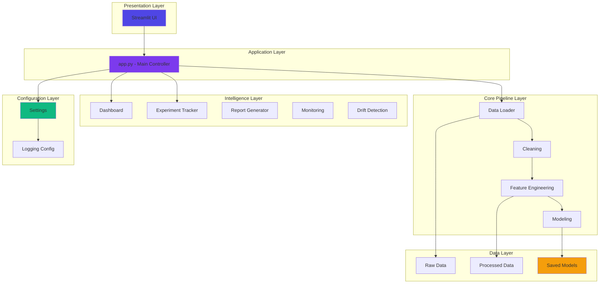
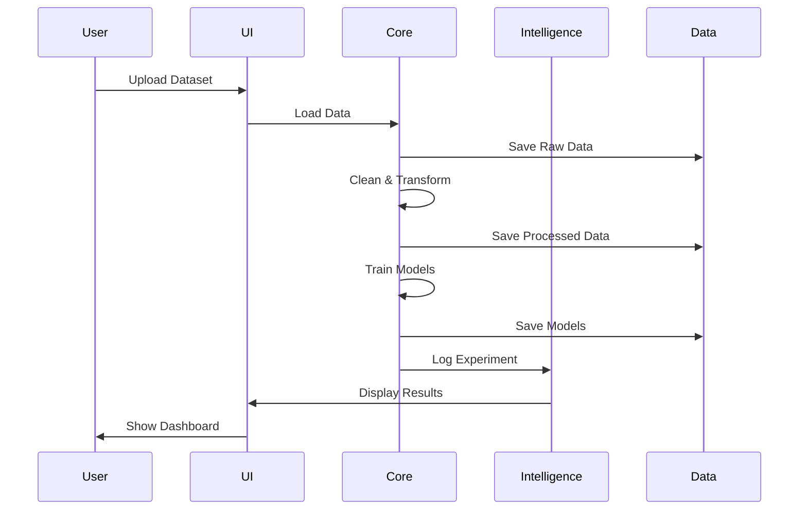
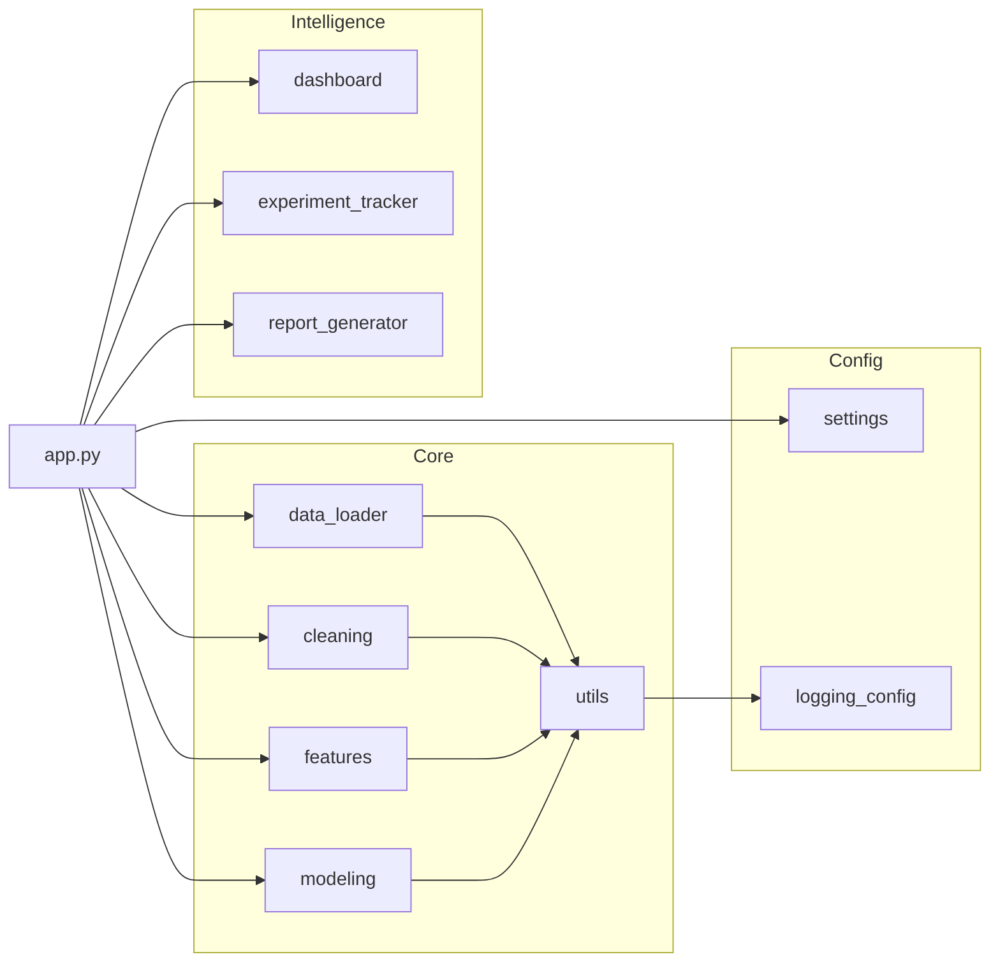

# System Architecture

## Overview

ANALYTIX.AI is a production-grade decision intelligence system built with a modular, layered architecture that separates concerns and enables scalability.

## Architecture Diagram

## Layer Descriptions

### 1. Presentation Layer
- **Streamlit UI**: Interactive web interface
- Handles user interactions
- Displays visualizations and results
- Manages session state

### 2. Application Layer
- **app.py**: Main application controller
- Orchestrates workflow between layers
- Manages application state
- Handles routing and navigation

### 3. Core Pipeline Layer
Implements the ML pipeline:

- **Data Loader**: File ingestion and validation
- **Cleaning**: Missing value imputation, outlier handling
- **Feature Engineering**: Feature selection, encoding, scaling
- **Modeling**: Model training, hyperparameter tuning, evaluation

### 4. Intelligence Layer
Advanced analytics features:

- **Dashboard**: Interactive analytics dashboard
- **Experiment Tracker**: ML experiment logging
- **Report Generator**: Automated report creation
- **Monitoring**: Production monitoring and alerts
- **Drift Detection**: Data and model drift detection

### 5. Configuration Layer
- **Settings**: Centralized configuration
- **Logging Config**: Logging setup and management

### 6. Data Layer
- **Raw Data**: Original uploaded files
- **Processed Data**: Cleaned and transformed data
- **Saved Models**: Trained model artifacts

## Data Flow

## Module Dependencies

## Design Patterns

### 1. Separation of Concerns
- Core logic separated from UI
- Configuration separated from code
- Tests separated from source

### 2. Dependency Injection
- Configuration injected via environment variables
- Paths managed centrally in settings

### 3. Factory Pattern
- Model creation based on problem type
- Feature engineering based on data type

### 4. Observer Pattern
- Experiment tracking observes model training
- Logging observes all operations

## Scalability Considerations

### Horizontal Scaling
- Stateless application design
- Session state managed by Streamlit
- Can deploy multiple instances behind load balancer

### Vertical Scaling
- Efficient memory management
- Lazy loading of large datasets
- Parallel processing where applicable

### Data Scaling
- Chunked processing for large files
- Incremental model training support
- Model persistence for reuse

## Security Architecture

### Input Validation
- File type validation
- Size limits on uploads
- Data type validation

### Data Protection
- Temporary file cleanup
- Secure model storage
- Environment variable protection

### Error Handling
- Graceful degradation
- Comprehensive logging
- User-friendly error messages

## Technology Stack

- **Frontend**: Streamlit
- **Backend**: Python 3.9+
- **ML Libraries**: scikit-learn, XGBoost, LightGBM
- **Data Processing**: pandas, numpy
- **Visualization**: plotly, matplotlib, seaborn
- **Containerization**: Docker
- **CI/CD**: GitHub Actions
- **Testing**: pytest
